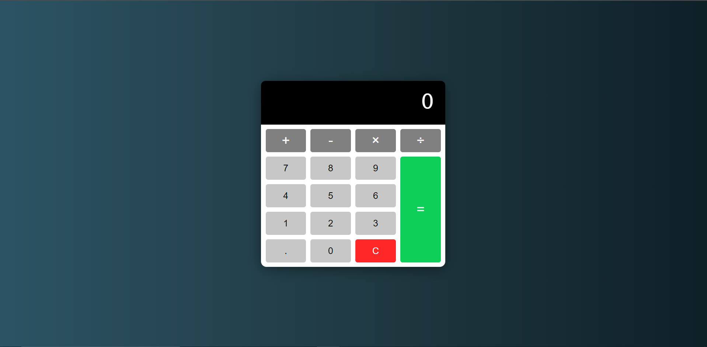

# calulator

## Description

An example of a calculator application created using HTML, CSS, & JavaSCript. A user can add, subtract, multiply, and divide using the operator buttons on the calculator. The c button acts as a clear function and resets the calculator display and equation variables on the calculator. This project uses JavaScript math functions, actionListners on the buttons, a forEach method to add different functions to each button and DOM manipulation to update the calculator display.

## Demo

A demo for the calculator can be found at the following link: https://tod619.github.io/calulator/
